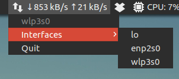

# NET Indicator

[](https://travis-ci.org/dawidd6/indicator-net)



### Installing from PPA
```sh
sudo add-apt-repository ppa:dawidd0811/indicators
sudo apt-get update
sudo apt-get install indicator-net
```

### Building from source
```sh
sudo apt install libappindicator3-dev
make
sudo make install
```
